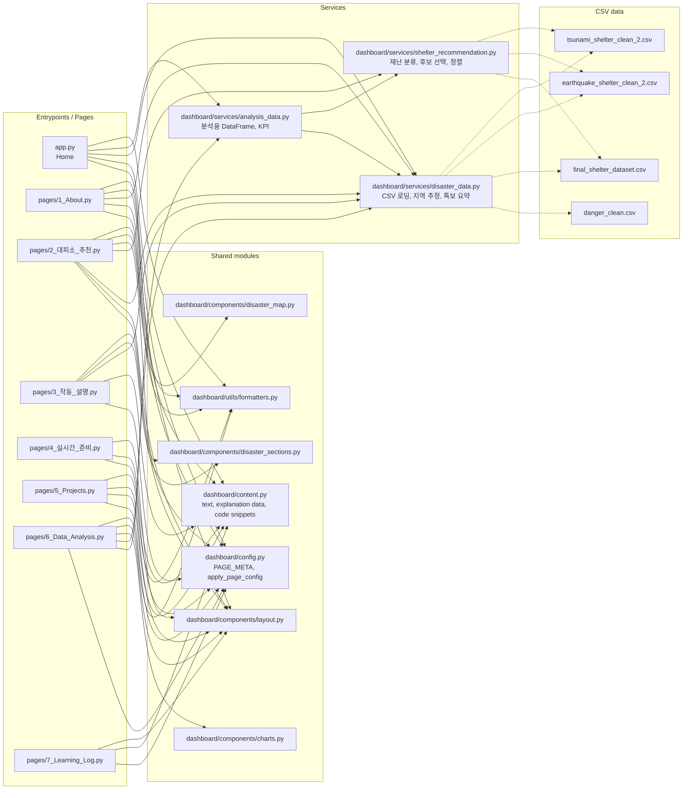
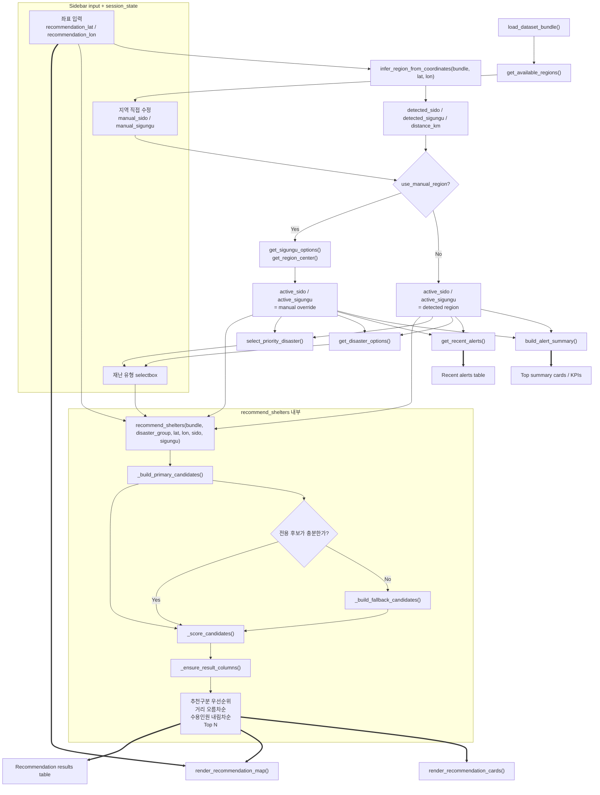

# 연결 구조 다이어그램 가이드

## 이 문서의 목적

함수와 모듈이 많이 나뉘어 있어도, 실제 구조는 `페이지가 조합하고`, `서비스가 계산하고`, `컴포넌트가 그려 주는` 형태로 정리된다.
이 문서는 그 연결을 두 장의 다이어그램으로 압축해서 보여 준다.

먼저 기억할 핵심은 아래 세 가지다.

- `pages/*.py` 는 허브다. 직접 계산을 많이 하지 않고 `services`, `components`, `utils` 를 조합한다.
- `dashboard/services/disaster_data.py` 는 CSV 로딩과 지역/특보 요약의 중심이다.
- `pages/2_대피소_추천.py` 는 `감지 지역` 과 `활성 지역` 을 분리해서 다루고, 추천 결과를 카드, 지도, 표로 나눠 소비한다.

## 화살표 범례

| 표시 | 뜻 | 예시 |
| --- | --- | --- |
| `A --> B` | import 또는 함수 호출 의존 | 페이지가 서비스/컴포넌트를 가져다 씀 |
| `A -.-> B` | 데이터 소스 또는 데이터 전달 흐름 | 서비스가 CSV 를 읽거나 결과 DataFrame 을 만듦 |
| `A ==> B` | 렌더링 소비 흐름 | 계산 결과가 카드, 지도, 표에 들어감 |

## 1. 앱 전체 계층 연결

### 전체 구조를 읽는 법

| 구간 | 어디에 연결되는가 | 어떤 역할인가 |
| --- | --- | --- |
| 홈 `app.py` | `config`, `content`, `disaster_data`, `analysis_data`, `formatters` | 앱 소개와 현재 연결된 데이터 범위를 보여 주는 입구 |
| 소개/설명 페이지 | 주로 `layout`, `content`, `disaster_data`, `disaster_sections` | 현재 구현과 문서 설명을 분리해서 보여 주는 층 |
| 추천 페이지 | `disaster_data` + `shelter_recommendation` + 지도/카드 컴포넌트 | 실제 추천 계산과 시각화가 모이는 핵심 허브 |
| 분석 페이지 | `analysis_data`, `charts`, `disaster_data` | 과거 특보/대피소 분포를 분석 관점으로 다시 구성 |
| `disaster_data.py` | CSV 4개, 여러 페이지, `analysis_data.py`, 추천 페이지 | 데이터 경로 결정, CSV 검증/정리, 지역 추정, 특보 요약 |
| `shelter_recommendation.py` | 추천 페이지, `analysis_data.py` | 재난 그룹 정규화, 후보 선택, 거리 계산, Top N 정렬 |
| `components/*` | 주로 페이지 파일에서 호출 | 화면 표현만 담당하고 계산 규칙은 들고 있지 않음 |

### 전체 구조 메모

- 페이지 파일은 "무엇을 보여 줄지"를 조합한다.
- 서비스 파일은 "무엇을 읽고 어떻게 계산할지"를 맡는다.
- 컴포넌트 파일은 "어떻게 그릴지"를 맡는다.
- `analysis_data.py` 가 `disaster_data.py` 와 `classify_disaster_type()` 를 같이 재사용하는 점이 서비스 간 연결의 대표 사례다.

## 2. `2_대피소_추천.py` 상세 호출 흐름

### 추천 페이지에서 헷갈리기 쉬운 연결

| 구간 | 실제 의미 | 코드에서 어디에 쓰이는가 |
| --- | --- | --- |
| `detected_*` | 좌표를 넣었을 때 자동 추정된 지역 | 현재 좌표가 어느 지역으로 읽히는지 설명할 때 사용 |
| `active_*` | 실제 특보 요약과 추천 계산에 공통으로 쓰는 최종 지역 | 수동 보정 여부에 따라 `detected_*` 또는 `manual_*` 를 선택 |
| `get_disaster_options()` | 지역 기준 최근 특보 + 기본 목록을 합쳐 selectbox 후보 생성 | 사이드바 재난 선택지 |
| `select_priority_disaster()` | 최근 특보 기준 기본 선택값 결정 | 재난 selectbox 초기값 |
| `recommend_shelters()` | 전용 후보와 fallback 후보를 합쳐 최종 Top N 생성 | 카드, 지도, 표가 모두 이 결과를 공유 |
| `render_recommendation_map()` | 추천 결과를 다시 계산하지 않고 받은 DataFrame 을 지도에 그림 | 사용자 위치 + 추천 대피소 + 직선 연결선 |

### 추천 페이지 데이터 흐름 메모

- 시작점은 `시도/시군구` 가 아니라 `좌표 입력` 이다.
- 자동 감지 결과가 마음에 안 들 수 있어서 `지역 직접 수정` 이 별도로 붙어 있다.
- 특보 요약, 최근 특보 표, 추천 계산은 모두 같은 `active region` 을 공유해야 서로 다른 지역을 보고 있지 않게 된다.
- 지도는 `추천 결과 DataFrame` 과 `사용자 좌표` 를 동시에 받는다. 그래서 카드/표와 같은 추천 결과를 보면서도 출발점 좌표를 따로 그릴 수 있다.
- 추천 엔진은 먼저 전용 후보를 보고, 부족하면 fallback 후보를 붙인 다음, 정렬 규칙을 한 번만 적용해 Top N 을 만든다.

## 빠른 추적 순서

코드를 다시 따라가야 할 때는 아래 순서가 가장 덜 헷갈린다.

1. `pages/2_대피소_추천.py` 에서 어떤 서비스 함수와 컴포넌트를 부르는지 본다.
2. `dashboard/services/disaster_data.py` 에서 지역 감지와 특보 요약이 어떻게 만들어지는지 본다.
3. `dashboard/services/shelter_recommendation.py` 에서 전용 후보, fallback, 정렬 규칙을 본다.
4. 마지막에 `dashboard/components/disaster_sections.py`, `dashboard/components/disaster_map.py` 에서 결과를 어떻게 그리는지 본다.
